# Capsule Neural Networks based Classification

# Required Libraries/Modules:

Python >= 3

NumPy

Tensorflow>=1.3

Tensorboard (usually comes with Tensorflow install)

GPU is required. We used Titan XP for training, validation and testing.

# Datasets used:

1) Fashion-MNIST

2) MNIST

# Process and Algorithm of used Neural Network:
In this assignment, we explore relatively newer type of convolutional neural network being introduced in NIPS, 2017 [1] named as “Capsule Networks”. They are proposed to cater for equi-variance issue in CNNs where a normal CNN is good in detecting and mapping complex objects but lack understanding of spatial relationship (perspective, position etc.) between such objects e.g. Nose and mouth spatial relationship in case of face detection. They combine neurons together in a smart way to do this as explained in detail below.

In simple but novel trick, capsule networks group neurons to form capsule layers that not only find probability of different features but also other parameters of those features e.g. angle, scale etc. So following figure gives basic difference between a neuron and a capsule [2].

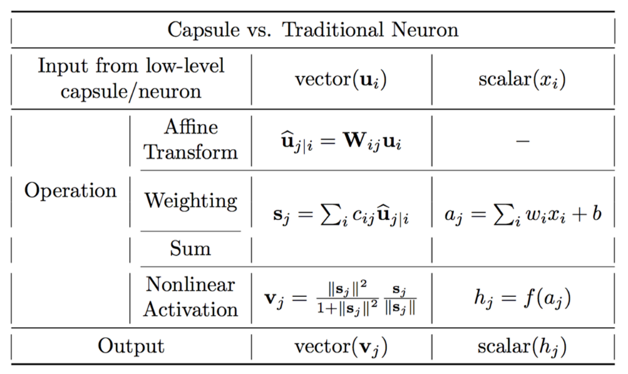

As shown in Fig. 1, capsules capture all important information about features in the form of vectors instead of only storing scalar (probability) value as in case of neurons. 
In mathematical operation terms, neurons work to learn weights using following steps:
Neurons
1. scalar weighting of input scalars
2. sum of weighted input scalars
3. scalar-to-scalar nonlinearity

Whereas Capsules do following operations:
1. matrix multiplication of input vectors
2. scalar weighting of input vectors
3. sum of weighted input vectors
4. vector-to-vector nonlinearity

Capsules also do not use bias value. This difference is shown in figure below [2]:

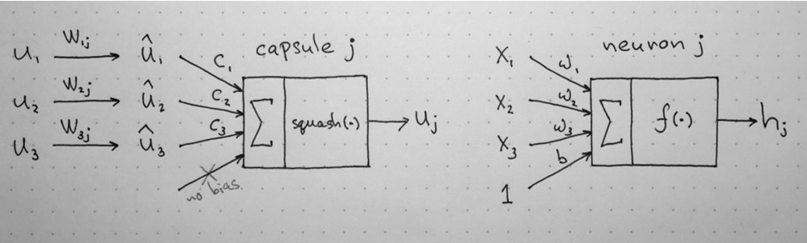

Consequently, different capsule layers form a capsule block. First such block is known as Parent capsule. Within each capsule block, they adjust their weights to form output of block amid learning spatial relationship. This is done using Dynamic Routing algorithm as in paper [1] and shown in following figure (as adapted form paper [1] and [2]):

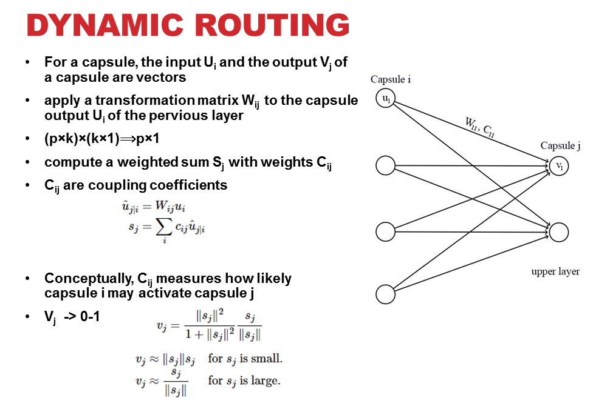

Above routing is done and adjusted iteratively, thus known as “iterative dynamic routing” so capsule at layer ‘i’ can learn about most suitable capsule in next layer ‘j’.  This learning process to route a capsule from previous layer to the next one in a capsule block to generate the final output of a capsule block is known as “Routing-by-agreement” which is as given in paper as follows [1]:

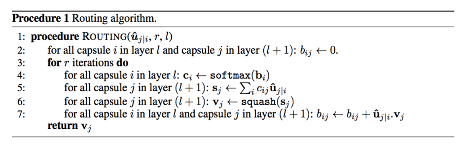

According to the paper [1], 3 iterations in above dynamic routing algorithm are the most suitable. We used 3 iterations during our experiments as well.
Capsule Network Architecture:
Finally, capsule network aka CapsNet is as follows as given in paper [1]:

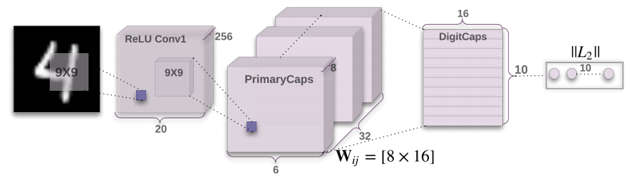

It consists of a primary capsule block after the first convolutional layer block. Primary capsule block consists of 32 depth size based 8D capsules.
Loss Function:
Capsules use a separate margin loss Lc for each category c digit present in as below [1]. During training, for each training example, one loss value will be calculated for each of the 10 vectors according to the formula then the 10 values will be added together to calculate the final loss [1]

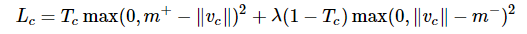

We think that following are some major pros and cons of using Capsule Networks after during our assignment experiments:
# Pros of CapsNet:
1. Less training data
2. Position and Pose information preserved (Equivariance)
3. Promising for segmentation and detection
4. Nicely map hierarchy of parts
5. Max Pooling alternate
6. Robust to translation, rotation
# Cons:
1. Not tested on larger images or different datasets
2. Cannot identify two identical objects very close to each other
3. Slow to train due to routing (Took us 3 days on average to train on MNIST and Fashion-MNIST separately for 50 epochs).

# Commands:

1) download dataset using following commands. It will save dataset in respective directory in data folder.

**For MNIST:**

mkdir -p data/mnist

wget -c -P data/mnist http://yann.lecun.com/exdb/mnist/train-images-idx3-ubyte.gz

wget -c -P data/mnist http://yann.lecun.com/exdb/mnist/train-labels-idx1-ubyte.gz

wget -c -P data/mnist http://yann.lecun.com/exdb/mnist/t10k-images-idx3-ubyte.gz

wget -c -P data/mnist http://yann.lecun.com/exdb/mnist/t10k-labels-idx1-ubyte.gz

gunzip data/mnist/*.gz

**For Fashion-MNIST:**

mkdir -p data/fashion-mnist 

wget -c -P data/fashion-mnist http://fashion-mnist.s3-website.eu-central-1.amazonaws.com/train-images-idx3-ubyte.gz

wget -c -P data/fashion-mnist http://fashion-mnist.s3-website.eu-central-1.amazonaws.com/train-labels-idx1-ubyte.gz

wget -c -P data/fashion-mnist http://fashion-mnist.s3-website.eu-central-1.amazonaws.com/t10k-images-idx3-ubyte.gz

wget -c -P data/fashion-mnist http://fashion-mnist.s3-website.eu-central-1.amazonaws.com/t10k-labels-idx1-ubyte.gz

gunzip data/fashion-mnist/*.gz

2) Training:

for MNIST

python main.py –datasetToUse mnist

or for fashion-mnist

python main.py – datasetToUse fashion-mnist 

3) for visualizing training loss graphs:

tensorboard --logdir=logdir --port= 6006 (or any other free port)

4) for accuracy:

python main.py --is_training=False

for fashion-mnist dataset

python main.py --datasetToUse fashion-mnist --is_training=False 

# Results:
We used 2 different datasets during our experiments; MNIST and Fashion-MNIST. In each case, we trained for 50 epochs that took on average approximately 3 days training time.  We also used batch size of 128. CapsNet also contain decoding or reconstruction part. But we skip most part of that as it is out of the scope of this assignment and focus mainly on prediction/classification part.

# Results on Fashion-MNIST:

Fashion-MNIST consists of 70,000 gray scale images of 28x28 size with a split of 60,000 training and 10,000 testing images. We zero padded to make them of 32x32 size for CapsNet. CapsNet accuracy in case of Fashion-MNIST comes out to be 90%. We have 2 losses; margin and reconstruction loss for encoder(or predicition) and decoder (or reconstruction) respectively as in Fig. 7 and Fig. 8. Finally total loss during training, which is the sum of these two losses, is shown in Fig. 9. Loss decreases as steps go on during training, thus indicating convergence of system.

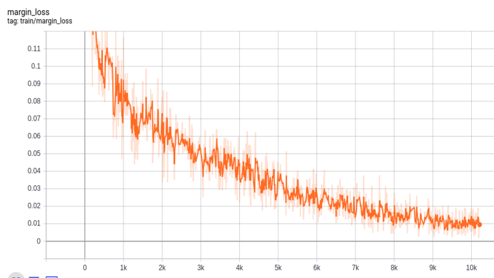

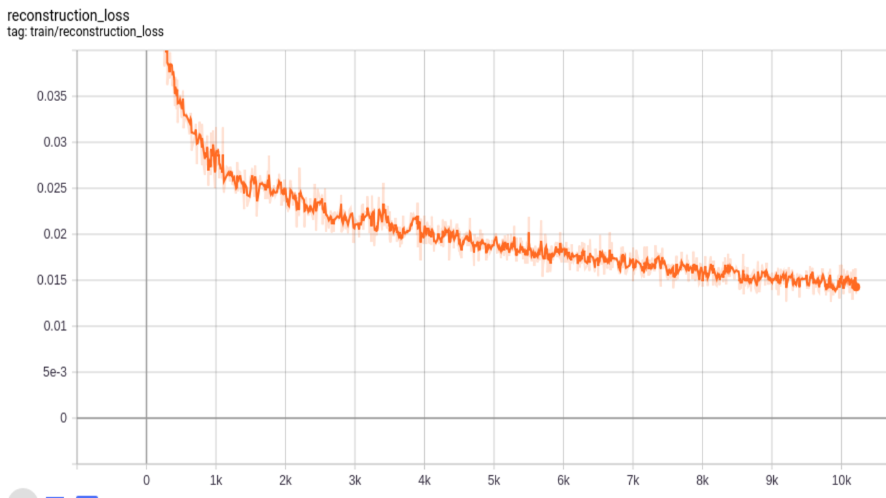

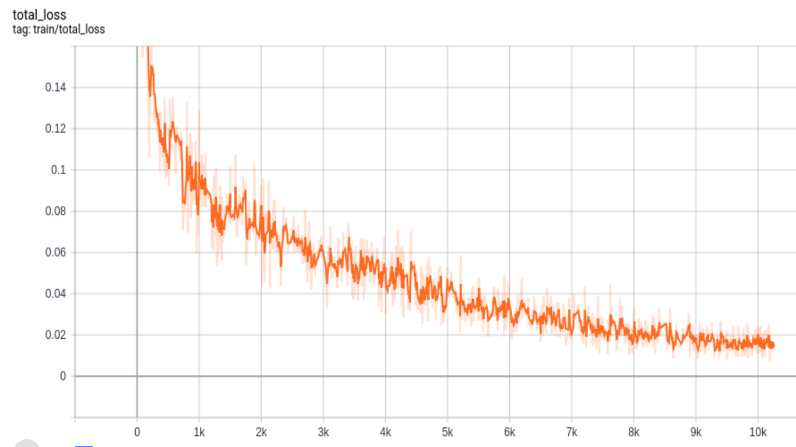

Although this is out of scope for this assignment as this work is focusing on prediction part, but following figure shows the reconstruction part of CapsNet decoder as visualized using TensorBoard.

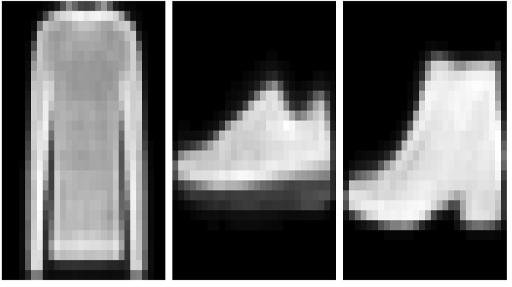

As it can be seen above, reconstructed images show that the model is training as required in right direction.

# Results on MNIST:

Similar to Fashion-MNIST, MNIST dataset consists of 70,000 images with a split of 60,000 training and 10,000 testing images of 28x28 size. For CapsNet, we zero-padded to make these images 32x32. The accuracy we get for MNIST dataset is 99%. Below we show different losses during training progress. We have 2 losses; margin and reconstruction loss for encoder(or predicition) and decoder (or reconstruction) respectively as in Fig. 10 and Fig. 11. Finally total loss during training, which is the sum of these two losses, is shown in Fig. 12. Loss decreases as steps go on during training, thus indicating convergence of system.

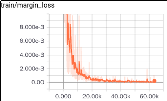

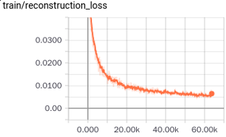

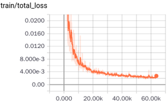

# Analysis:

Following are some observations/analysis about capsule neural networks that we made during this assignment work:
1. Network is shallow (not like deep CNN models)
2. Dynamic routing co-efficient Cij’s are computed runtime (training and testing) and thus not learnable
3. Still need backpropogation for W’s
4. Still convolution is required
5. Due to iterative dynamic routing algorithm, they take a lot of training and validation time (3-4 days on average for us) even on a pretty decent Titan Xp GPU.

Finally,they have some major issues like they take so much time and consequenty slow as well. But they give a new perspective in deep learning research with focus on establishing spatial relationship between related objects in an image.

References:

[1] Sabour, Sara, Nicholas Frosst, and Geoffrey E. Hinton. "Dynamic routing between capsules." Advances in neural information processing systems. 2017.

[2] https://pechyonkin.me/capsules-2/
